# erichVK5-suzy-Q-cable-v1

A simple closed debugging cable breakout PCB to allow reflashing of firmware on Chromebooks using signed firmware/CR50 systems to allow alternative operating systems to be installed more easily. The original "SuzyQ" cables previously available for this were quite expensive, due to their USB 3.1 cabling, and embedded USB hub. This is a much simpler and cheaper design. 

The prototype PCB in the FOSS layout editor pcb-rnd: 

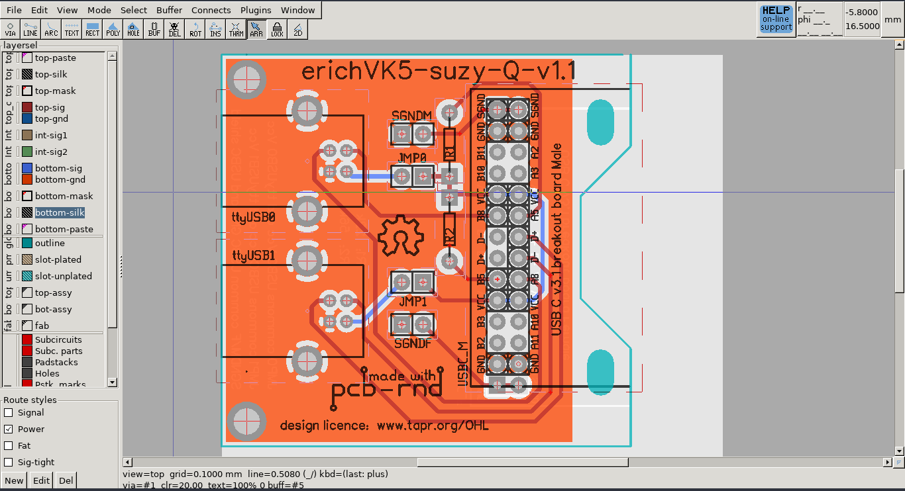

The schematic in the FOSS schematic editor sch-rnd:

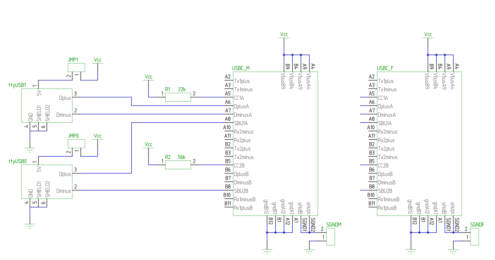

The board is 49mm wide and 47mm high. The boards were manufactured by SEEED with the gerbers in this repository.

The board is designed to accommodate a readily available and inexpensive USB type C 3.1 breakout board which comes in versions with either a male or female USB-C v3.1 connector, and two standard USB type B connectors with kinked solder tabs (i.e. Molex 670687041) to allow assembly with simple through hole soldering, and avoiding the need for an expensive USB 3.1 cable if using the male version of the USB-C breakout board.

Only one Type B USB port socket for ttyUSB0 needs to be installed if there is no need for access to the debugging console on ttyUSB1.

The 5V pins on the Type B USB cables are not connected to the USB type C VCC pins by default, in case different machines (with slightly different USB "5V" voltages) might be used for monitoring ttyUSB0 and/or ttyUSB1. The USB Type B 5V rails can be commoned to the USB Type C Vcc rail by putting links or a low value resistor across JMP0 and/or JMP1. A link placed across SGNDM can be used to common the Male USB type C cable shield to the ground pins/ground network of the circuit; similarly, a link placed across SGNDF can be used to common a Female USB type C cable shield to the ground pins/ground network of the circuit, but commoning of shields to ground was not found to be necessary for the prototype to work.

If the male (plug) version of the USB-C breakout shield is used, it should be attached to the top surface of the board. If the female (socket) version of the USB-C breakout shield is used, it should be attached to the bottom surface of the board, to achieve the required mirroring of pin connections effected by the reversed gender.

Importantly, some of the commonly available Male USB-C breakout boards have silkscreen markings applicable to the Female socket version, so the pin numbering is actually back to front, i.e. A2 should be A11, B11 should be B2, etc...:

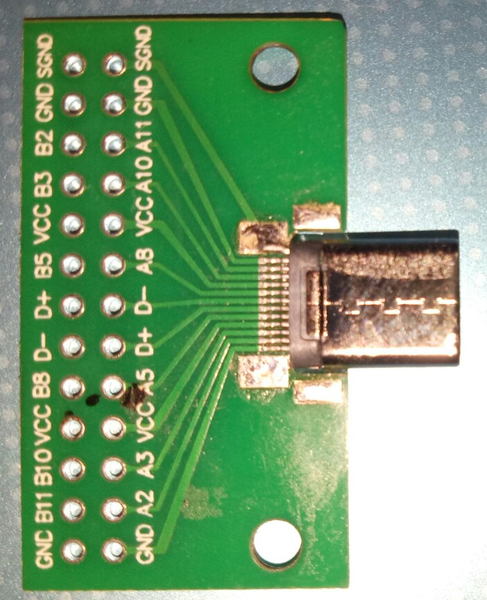

# Assembly

Jumpers or wire links are needed to common the 5V rails of the Type C connector and the Type B USB connector for the board to be recognised as plugged in. These links could be replaced with a low value resistor if it is being plugged into a different machine, to minimise the risk of current surges between differing power rails.

There is not much to assembly, other than a type B USB socket for ttyUSB0, the Type C breakout board, ideally a two row header to simplify soldering of the type C breakout board to the SuzyQ board, and the JMP0 jumper link. R1 is a 22k resistor, and R2 is a 56k resistor. These values tell the  USB C host what voltage levels are to provided on the USB C Vcc rail.

The ttyUSB1 socket and JMP1 link are not needed for routine firmware reflashing.

This is the top view with the Type C Male breakout board mounted on the top surface

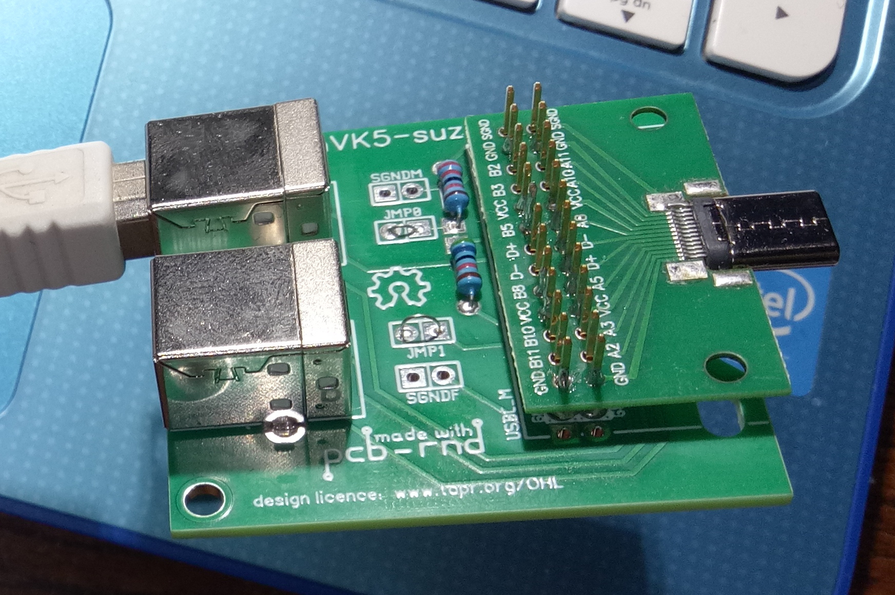

This is a view of the underside with the Type C Male breakout board mounted on the other (top) side surface

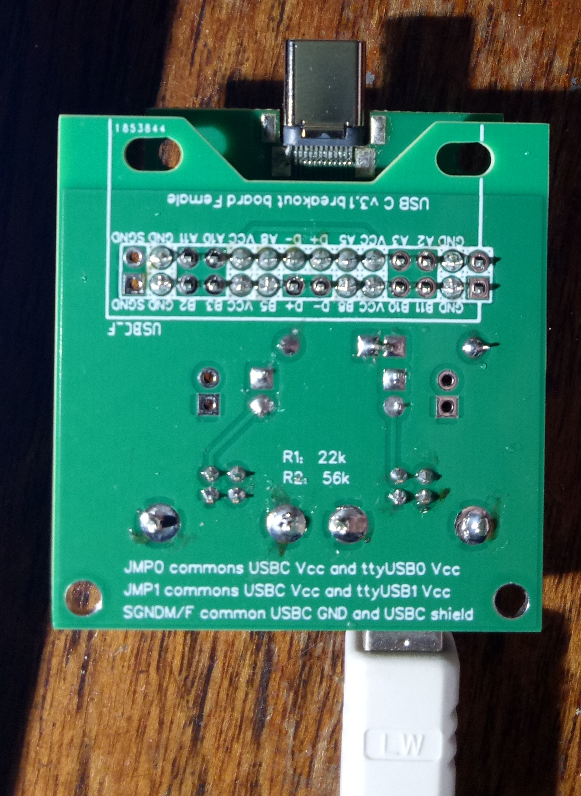

If you look closely, the two rows of pins for the breakout board only need soldering where the silkscreen has a circle around the pin.

If a female Type C breakout board is used, it will need to be attached to the underside, to effect the necessary inversion of pins. It is best to use the Type C male breakout board, as Type C <-> Type C USB cables with all of the necessary wires are quite expensive.

This is the unit plugged into a Lenovo Ideapad chromebook Type C power socket

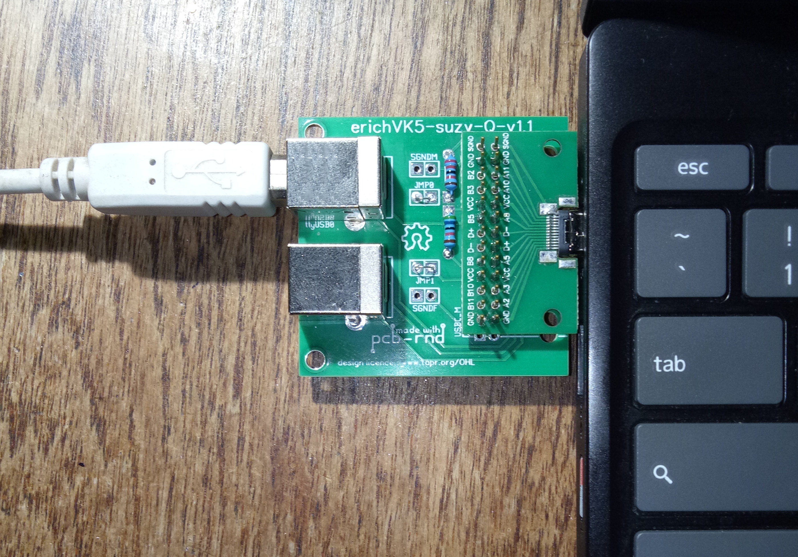

This is the unit plugged into the same Lenovo Ideapad chromebook Type C power socket with the type B to type A USB cable being used to bring ttyUSB0 to one of the spare type A USB ports on the Chromebook.

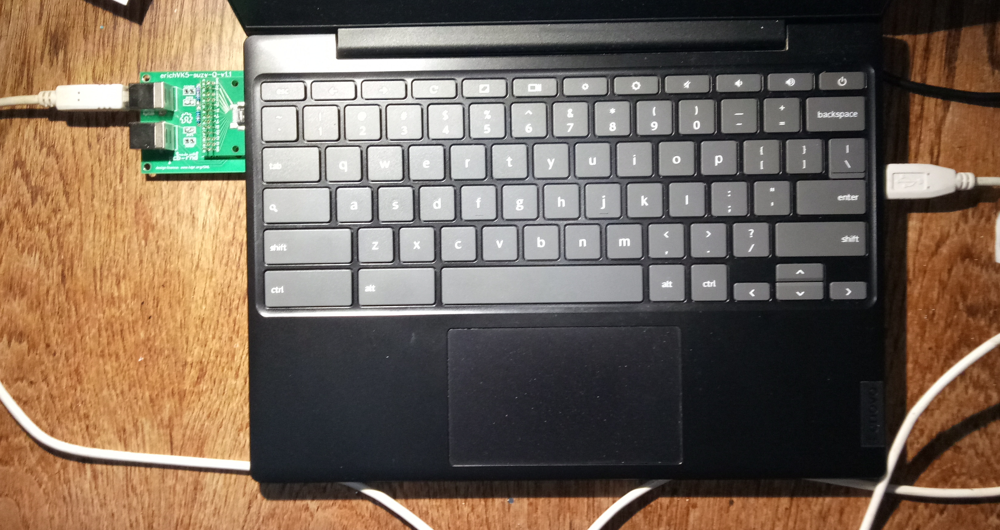

On the ideapad running Lubuntu 20.04, a terminal shows the results of the SuzyQ board being plugged in when the dmesg command is run, and also subsequent querying of available ttyUSB devices after insertion of the board confirms that new ttyUSB devices are present, and importantly, ttyUSB0 is available to connect to for closed debugging:

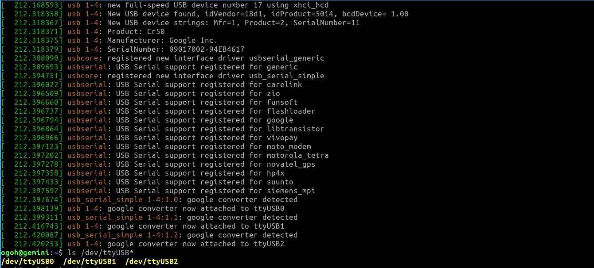

The ttyUSB0 device can be connected to under linux with a serial terminal such as minicom, which will need configuring to use ttyUSB0 for serial IO. The user account, if running GNU/linux or similar, will also need to be a member of dialout to access this port.

Once connected to ttyUSB0, a HELP command can be issued:

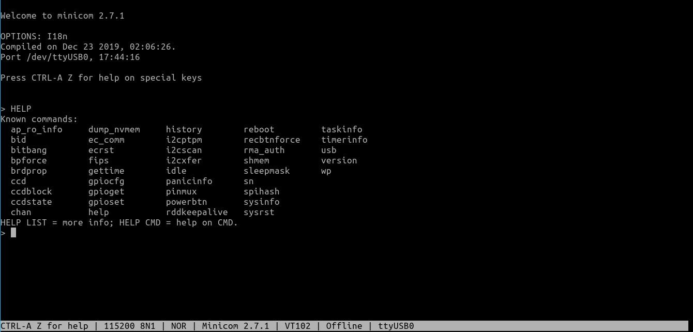

A more detailed HELP-LIST command can be also be issued:

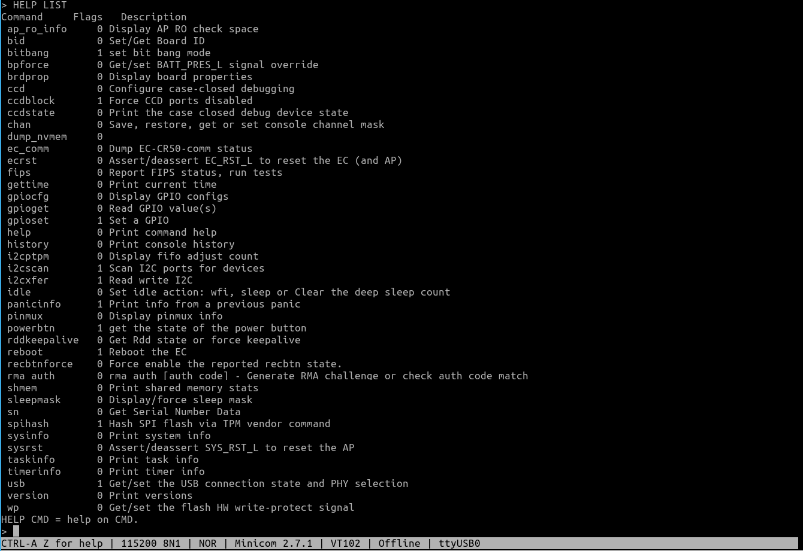

On the same ideapad, the board ID is queried, confirming it is a Geminilake motherboard using CR50 firmware signing:

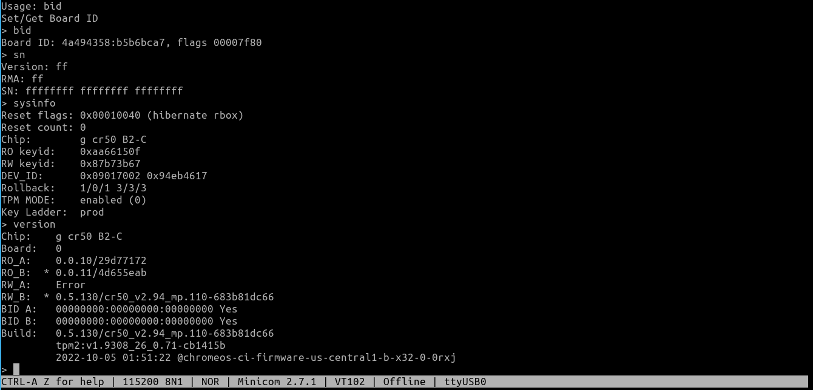

For those intending to turn off firmware signing on CR50 chromebooks or similar, the latest instructions are available at https://mrchromebox.tech/

Turning off firmware signing on newer chromebooks will allow custom firmware such as that available from mrchromebox to be installed which will allow alternative operating systems such as GNU/linux to be installed, rather than the default ChromeOS.

For the price paid, and the hardware supplied, Chromebooks are very cost effective devices for STEM and coding generally, and are well suited to running GNU/linux distributions.

# Cautionary note

This SuzyQ adaptor has been tested successfully on a CR50 based Lenovo Ideapad Chromebook with a GeminiLake motherboard, but your mileage may vary on other devices, and there is always a possibility of harm being done to USB ports if specifications change or there are mistakes during assembly.   
