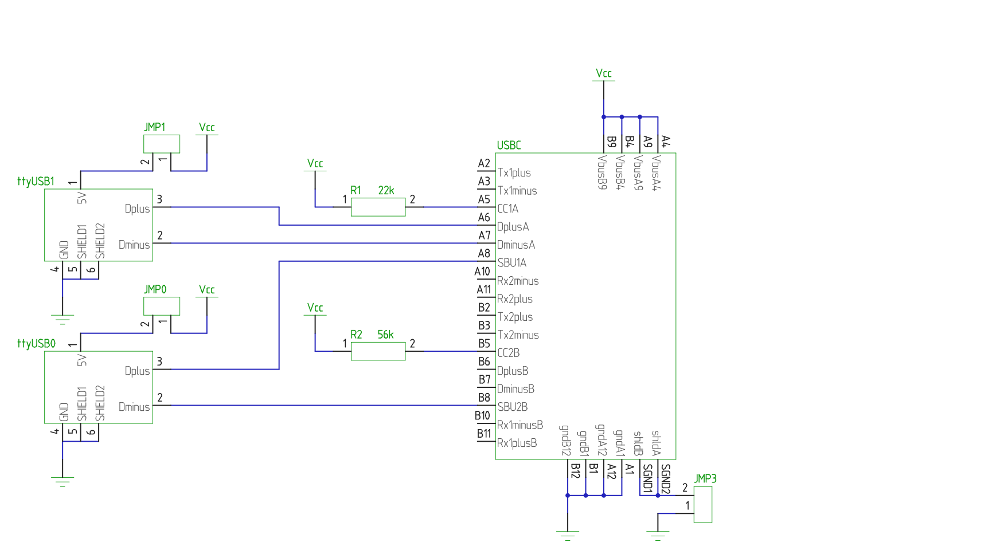

# erichVK5-suzy-Q-cable-v1

A simple closed debugging cable breakout PCB to allow reflashing of firmware on Chromebooks using signed firmware/CR50 systems to allow alternative operating systems to be installed more easily.

The prototype PCB in the FOSS layout editor pcb-rnd: 

The schematic in the FOSS schematic editor sch-rnd:

The board is 48mm wide and 44mm high. Manufacture of the boards and testing is a work in progress.

The board is designed to accommodate a readily available and inexpensive USB C 3.1 breakout board with a male connector, and two standard SUB type B connectors to allow assembly with simple through hole soldering.
